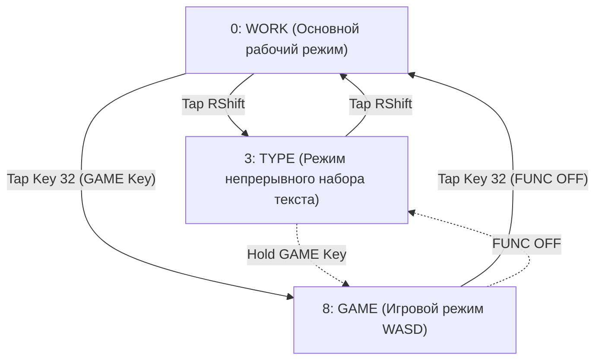

# 01. Философия и архитектурная концепция раскладки

[← Назад к Оглавлению](file:///c:/Users/Starlex/Documents/GitHub/ErgoDox/docs/layout/00_INDEX.md) | [Вперёд: Атлас 14 слоёв →](file:///c:/Users/Starlex/Documents/GitHub/ErgoDox/docs/layout/02_LAYERS.md)

---

## 🎯 Главная цель и триада состояний

Большинство раскладок пытаются быть «компромиссом для всего»: одновременно удобными для набора длинного текста, программирования, работы с окнами приложений и компьютерных игр. Из-за этого возникают фундаментальные конфликты:
- **Home Row Mods** (модификаторы на домашнем ряду) идеальны для шорткатов и навигации, но при скоростной слепой печати могут приводить к ложным срабатываниям модификаторов (misfires).
- **AutoShift** (долгий тап буквы дает заглавную) ускоряет печать текста, но ломает привычный ввод комбинаций клавиш и шорткатов.
- **Двухфункциональные клавиши (Tap-Hold)** вызывают задержку срабатывания или залипания в динамичных играх (например, в WASD).

Концепция **WORK-TYPE-GAME** решает этот конфликт радикально: **разделением клавиатуры на три чётких режима**, переключаемых на лету:



---

## 1. Режим WORK (Слой 0) — Фокус на шорткатах и одноручной работе с мышью

**WORK** — это базовый слой по умолчанию. Его ключевые столпы:

1. **Miryoku-архитектура**:
   - 3 ключевые клавиши под каждым большим пальцем отвечают за базовые символы при тапе (Пробел, Backspace, Enter, Delete, Tab, Esc) и активируют функциональные слои при удержании.
   - Модификаторы домашнего ряда (**Home Row Mods**):
     - Левая рука: `N = Alt`, `S = Shift`, `T = Ctrl`, `G = GUI / Win`
     - Правая рука: `A = Alt`, `E = Shift`, `H = Ctrl`, `K = GUI / Win`
     - Порядок модификаторов: **Alt - Shift - Ctrl - GUI** (от мизинца к указательному).
   - Действие слоя, вызываемого большим пальцем одной руки, разворачивается на противоположной руке.

2. **Принцип «Левая рука на клавиатуре, правая на мыши»**:
   - В типичном рабочем процессе (браузер, IDE, графика, таблицы) правая рука лежит на мыши. Снимать руку с мыши ради одной цифры, стрелки, Enter или шортката — колоссальная потеря времени и эргономический стресс.
   - Для этого в раскладке предусмотрены:
     - **Слой SWAP (Слой 1)**: временное «зеркалирование» клавиш правой руки под левую руку через клавишу `OSL(SWAP)`.
     - **Слой LNPD (Слой 2)**: полноценный цифровой блок (Numpad) под левой рукой!
     - **Левый Enter**: на левой половине клавиатуры выделена отдельная клавиша Enter под указательный палец.
     - **Левый блок макросов**: кнопки воспроизведения динамических макросов `DM_PLY1` и `DM_PLY2` расположены на нижнем ряду левой руки.

---

## 2. Режим TYPE (Слой 3) — Чистый писательский поток и AutoShift

При наборе больших объёмов прозы, кода или статей Home Row Mods могут раздражать случайными аккордами при быстром качении пальцев (finger rolls).

1. **Полное отключение Home Row Mods**:
   - На слое `TYPE` домашний ряд становится обычными буквами без каких-либо функций удержания. Ошибочно вызвать Ctrl или Win невозможно физически.
2. **Активация AutoShift**:
   - Только на этом слое включен режим `AutoShift` с ультракоротким таймаутом `120 ms`.
   - Краткий тап по букве = строчная буква.
   - Удержание чуть дольше обычного (>120 мс) = заглавная буква.
   - Мизинец полностью освобождается от необходимости зажимать Shift при наборе прописных букв.
3. **Органы управления AutoShift прямо на клавиатуре**:
   - Клавиши переключения: `AS_TOGG` (вкл/выкл AutoShift), `AS_RPT` (повтор), `AS_UP` (увеличение задержки), `AS_DOWN` (уменьшение задержки).
4. **Быстрый тумблер**:
   - Переход в режим `TYPE` осуществляется мгновенным тапом по правому Shift (`DUAL_FUNC_2`), а возврат в `WORK` — повторным тапом по нему же (`DUAL_FUNC_4`).

---

## 3. Режим GAME (Слой 8) — Истинный гейминг без задержек

Игры предъявляют особые требования:
- Никаких задержек распознавания tap/hold (нужен мгновенный отклик при нажатии).
- Классическое расположение WASD.
- Доступность цифр 1–6, F1–F4, Esc, Tab, Space, Shift, Ctrl левой рукой без смещения ладони.

Реализация в GAME:
1. **Сдвиг левого блока на одну колонку вправо**:
   - Клавиши W, A, S, D располагаются на позициях домашнего ряда (E, S, D, F физически), что позволяет держать руку в естественной домашней позиции, а не скрючивать пальцы у самого края.
2. **Полное отсутствие двухфункциональных клавиш (Zero Dual-Function)**:
   - Все клавиши работают строго как `KC_*`, регистрируя нажатие в нулевую миллисекунду.
3. **Клавиши F1–F4 на внешнем левом столбце**:
   - Доступны прямо под мизинцем без переключения слоев.
4. **Кнопка Push-to-Talk**:
   - Физическая кнопка `Mouse Button 5` выведена на клавишу клавиатуры для голосового чата (Discord/игры).
5. **Слой GSWP (Слой 9)**:
   - Специальный игровой зеркальный слой: если в игре нужно нажать кнопку из правой части клавиатуры, зажимается клавиша `OSL(GSWP)` под большим пальцем.

---

## 4. Цифровой ряд: Натуральный последовательный порядок

По вашему выбору в раскладке применён привычный естественный порядок цифр вместо частотного:

```
Левая рука:   `   1   2   3   4   5   [
Правая рука:  ]   6   7   8   9   0   =
```

Это исключает путаницу при вводе паролей, чисел и формул и сохраняет стандартную мышечную память.

---

## 5. Буквенная раскладка: Классический QWERTY и совместимость с ЙЦУКЕН

В качестве основной буквенной раскладки установлен **стандартный QWERTY**:
- **Плавный переход**: переход на сплит-клавиатуру ErgoDox происходит естественно, без необходимости переучивать алфавит.
- **Горячие клавиши**: комбинации `Ctrl+Z`, `Ctrl+X`, `Ctrl+C`, `Ctrl+V`, `Ctrl+A` находятся на своих стандартных физических местах.
- **Идеальная совместимость с кириллицей (ЙЦУКЕН)**: при переключении языка в ОС буквы русского алфавита ложатся 1-в-1 на свои стандартные места. На ErgoDox есть все физические клавиши для букв `Ё`, `Х`, `Ъ`, `Ж`, `Э`, `Б`, `Ю`.

---

## 6. Игровой режим GAME: Классический стандарт WASD

В отличие от оригинального сдвинутого профиля автора, в вашей конфигурации игровой режим полностью классический:
- Клавиши **W, A, S, D** находятся на своих стандартных позициях (`Q W E R`, `A S D F`, `Z X C V`).
- **Левый Shift** и **левый Ctrl** расположены в привычных внешних углах для естественного спринта и приседания.
- Цифры `1 2 3 4 5 6` расположены над WASD в стандартном порядке.
- Никаких задержек: все клавиши работают мгновенно (zero tap-hold latency).

---

## 6. Принцип аварийного выхода: Клавиша FUNC OFF

В сложных раскладках с 14 слоями главная фобия пользователя — **«заблудиться в слоях»** (залипнуть в слое символов, стрелок или Numpad и не мочь печатать).

Автор решил эту проблему гениально простым инвариантом:
- Физическая клавиша внутреннего верхнего угла левого кластера больших пальцев (Key 32) на всех вспомогательных слоях назначена как **`FUNC_OFF`** (сброс в базовый слой `TO(0)`).
- Какое бы состояние ни зависло — один тап по Key 32 гарантированно возвращает клавиатуру в чистый базовый режим.
