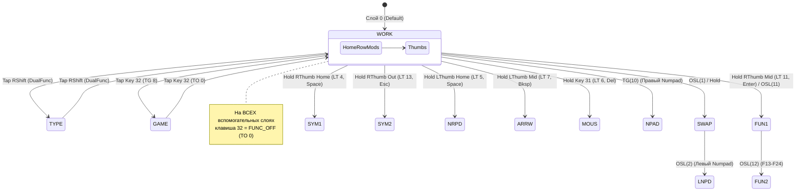

# 02. Полный атлас 14 слоёв раскладки

[← Философия и архитектура](file:///c:/Users/Starlex/Documents/GitHub/ErgoDox/docs/layout/01_PHILOSOPHY.md) | [Оглавление](file:///c:/Users/Starlex/Documents/GitHub/ErgoDox/docs/layout/00_INDEX.md) | [Вперёд: Нестандартные настройки и механики →](file:///c:/Users/Starlex/Documents/GitHub/ErgoDox/docs/layout/03_SETTINGS_AND_MECHANICS.md)

---

## 🗺️ Общая схема взаимосвязи слоёв

---

## Слой 0: `WORK` (Основной рабочий режим)

Базовый слой для 90% повседневных задач: программирование, работа с текстом со шорткатами, браузер, управление ОС.

### Ключевые особенности
1. **Home Row Mods**:
   - Левая рука: `N` (Alt), `S` (Shift), `T` (Ctrl), `G` (Win/Gui).
   - Правая рука: `A` (Alt), `E` (Shift), `H` (Ctrl), `K` (Win/Gui).
   - *Примечание автора*: Модификаторы `G` и `K` (Win) имеют укороченный таймаут (-40ms), чтобы избежать случайного открытия меню Пуск/Spotlight при беглой печати.
2. **Кластер больших пальцев (Thumb Cluster)**:
   - **Левый большой палец**:
     - `Key 35`: Тап = Пробел, Удержание = Слой `NRPD` (цифры и стрелки левой рукой).
     - `Key 36`: Тап = Backspace, Удержание = Слой `ARRW` (навигация и форматирование).
     - `Key 37`: Tab.
     - `Key 31`: Тап = Delete, Удержание = Слой `MOUS` (управление мышью).
     - `Key 32`: `TG(8)` — переключение в режим `GAME`.
     - `Key 33`: `OSL(1)` — однократный переход в слой `SWAP`.
     - `Key 34`: `OSL(11)` — однократный переход в слой `FUN1`.
   - **Правый большой палец**:
     - `Key 75`: Тап = Пробел, Удержание = Слой `SYM1` (основные символы).
     - `Key 74`: Тап = Enter, Удержание = Слой `FUN1` (функциональные клавиши F1–F12).
     - `Key 73`: Tab.
     - `Key 65`: Тап = Escape, Удержание = Слой `SYM2` (дополнительные символы / системное меню).
     - `Key 72`: `TG(10)` — переключение правого Numpad (`NPAD`).
3. **Левая рука для мыши (Одноручные шорткаты)**:
   - `Key 7`: **Enter левой руки** (под левым мизинцем/безымянным).
   - `Key 20`: `MT(Shift, CapsLock)` — тап = CapsLock, удержание = Shift.
   - `Key 27`: `MT(Ctrl, App/Menu)` — вызов контекстного меню правой кнопки мыши левой ладонью.
   - `Key 28`: `MT(Alt, Insert)`.
   - `Key 29` и `30`: `DM_PLY2` и `DM_PLY1` (воспроизведение динамических макросов левой рукой).
   - `Key 66` и `67`: `DM_REC1` и `DM_REC2` (запись макросов на правой руке).
4. **Стрелки/Страницы через Tap Dance**:
   - `Key 13` (`DUAL_FUNC_0`): Тап = `Up`, Удержание = `Page Up`.
   - `Key 26` (`DUAL_FUNC_1`): Тап = `Down`, Удержание = `Page Down`.

---

## Слой 1: `SWAP` (Зеркалирование под левую руку)

Вызывается клавишей `OSL(1)` (One-Shot Layer) на левом кластере пальцев.

### Назначение
Переносит все клавиши правой половины клавиатуры на левую половину, пока правая рука лежит на мыши:
- Клавиши правой руки (`Y, O, U, L, '`, `I, A, E, H, K`, `/, ., ,, Q, J`) зеркально отображаются на левую матрицу.
- Модификаторы зеркалируются на домашний ряд левой руки: `A` (Alt), `E` (Shift), `H` (Ctrl), `K` (Gui).
- Большой палец: Пробел и Enter доступны левой рукой.
- Клавиша `Key 34` ведет на `OSL(2)` — **LNPD** (левый Numpad).
- Клавиша `Key 32` — `FUNC_OFF` (`TO(0)`).

---

## Слой 2: `LNPD` (Левосторонний Numpad)

Вызывается из `SWAP` через `OSL(2)`.

### Назначение
Полноценный бухгалтерский цифровой блок под левую руку.
- Цифры 1–9 расположены классической сеткой 3x3, причём ориентация не отзеркалена, чтобы стрелки Numpad сохраняли интуитивное направление.
- Математические операторы `+`, `-`, `*`, `/`, `=`, Enter, запятая и точка.
- Клавиша `NumLock` объединена с `Shift` через Mod-Tap.
- Двухфункциональная клавиша `=` (`DUAL_FUNC_3`): тап = `=`, удержание = `KP_=`.

---

## Слой 3: `TYPE` (Писательский режим без Home Row Mods)

Включается тапом по правому Shift на базовом слое (`WORK Shift` / `Key 64`). Выход обратно в WORK — повторный тап по той же клавише (`type_shift RSHFT 0`).

### Назначение
- **100% идентичность кластера больших пальцев и служебных клавиш слою `WORK`**: пробелы, Backspace, Enter, Tab, стрелки, переключатели слоев (`OSL SWAP`, `OSL FUN1`, `TG GAME`, `TG NPAD`, `LT SYM1`, `LT NRPD`, `LT ARRW`, `LT MOUS`, `LT SYM2`) работают в точности так же, как на основном слое.
- **Снятие модификаторов с домашнего ряда**: клавиши `A, S, D, F` (левая рука) и `J, K, L, ;` (правая рука) очищены от hold-модификаторов и работают как 100% чистые символы для сверхбыстрой слепой печати без случайных ложных срабатываний хоткеев (zero misfires).
- **Возврат в `WORK`**: клавиша 64 (правый Shift) при тапе мгновенно переключает обратно на слой `WORK (0)`, а при удержании работает как обычный `Right Shift`.

---

## Слой 4: `SYM1` (Базовые нешифтовые символы и Переключение языков)

Активируется удержанием правого основного пробела (`Key 75`). Доступен из любых режимов (`WORK` и `TYPE`).

### Логика раскладки
1. **Выделенные переключатели языков (EN / RU / UA)**:
   - **Двуручный способ (левая рука, цифроряд)**:
     - `Key 1`: **EN** (`Ctrl+1`) — английский язык.
     - `Key 2`: **UA** (`Ctrl+2`) — украинский язык.
     - `Key 3`: **RU** (`Ctrl+3`) — русский язык.
     *Удерживая правый пробел, пальцы левой руки мгновенно тапают нужный язык по его номеру.*
   - **Одноручный способ (правая рука, ряд U-I-O)**:
     - `Key 47` (U): **EN** (`Ctrl+1`).
     - `Key 48` (I): **UA** (`Ctrl+2`).
     - `Key 49` (O): **RU** (`Ctrl+3`).
     *Правый большой палец держит пробел, а указательный/средний/безымянный палец той же руки тапает U, I или O. Идеально для работы одной рукой!*
2. **Символы обрамления в центре**: скобки `(`, `)`, `[`, `]` расположены рядом на сильных пальцах.
3. **Стрелка влево на домашнем ряду (`Key 15`)**: позволяет сразу после ввода пары скобок сделать шаг назад внутрь них!
4. **Знак подчеркивания `_` на месте пробела (`Key 35`)**: эргономический триумф для программистов — ввод переменных в `snake_case` выполняется так же естественно, как обычные пробелы.
5. **Левая половина (символы)**: `` ` [ ] ' = - ( ) ! ; \ # @ / $ ``.
6. **Правая половина (модификаторы)**: `Gui`, `Ctrl`, `Shift`, `Alt` в классическом порядке для ввода аккордов с символами.
7. `Key 0`: физический `Escape` (для ситуаций, когда Esc нужно долго удерживать).

---

## Слой 5: `NRPD` (Number Row Pad — цифровой блок и левая навигация)

Активируется удержанием левого основного пробела (`Key 35`).

### Логика
- **Правая половина**: цифровой блок с операторами:
  - Цифры `1–9` и `0` в удобной сетке.
  - Операторы: `+`, `-`, `*`, `/`, `=`, а также символы `:`, `,`, `.`.
  - Модификаторы в нижнем ряду в формате One-Shot (`OSM`).
- **Левая половина**: левосторонняя навигация и правка:
  - Стрелки `Up, Down, Left, Right` под указательным и средним пальцами.
  - `Backspace`, `Delete`, `Home`, `End`, `Page Up`, `Page Down`.
  - Классический блок `Ctrl+Z`, `Ctrl+X`, `Ctrl+C`, `Ctrl+V` на ряду ZXCV для быстрого редактирования левой рукой.
  - Клавиша `QK_LLCK` (Layer Lock): позволяет зафиксировать слой и свободно вводить числа обеими руками.

---

## Слой 6: `MOUS` (Управление курсором мыши и медиа)

Активируется удержанием клавиши Delete (`Key 31`).

### Логика
- **Левая рука**: кнопки мыши и ускорение:
  - `Mouse Button 1, 2, 3, 4, 5`.
  - Ускорители движения курсора: `Accel 0` и `Accel 2`.
  - Правка: `Ctrl+Z, X, C, V`.
- **Правая рука**: движение курсора и медиа:
  - Движение курсора: `Mouse Up, Down, Left, Right`.
  - Колесо прокрутки: `Wheel Up, Down, Left, Right` (4-позиционный скролл!).
  - Медиа-блок: Громкость `Vol+`, `Vol-`, `Mute`, треки `Prev`, `Next`, `Play/Pause`, `Stop`.

---

## Слой 7: `ARRW` (Навигация, выделение и форматирование)

Активируется удержанием клавиши Backspace (`Key 36`).

### Логика
- **Правая рука**: полноценный перевернутый T-кластер стрелок + `Home, End, PgUp, PgDn, Delete`.
- **Левая рука**: быстрые шорткаты форматирования текста:
  - `Ctrl+B` (Bold), `Ctrl+I` (Italic), `Ctrl+U` (Underline), `Ctrl+K` (Hyperlink).
  - Шорткаты буфера обмена (`Ctrl+Z, X, C, V`).
- **Макрос AutoNumber (`Key 60`)**: кастомный инкрементный счетчик чисел/букв.
- Тап по `Tab` на большом пальце для быстрого перехода по полям форм и таблиц.

---

## Слой 8: `GAME` (Выделенный игровой режим)

Переключается клавишей `Key 32` (`TG(8)`). Выход — той же клавишей (`FUNC_OFF`).

### Логика
- Классическая раскладка QWERTY (WASD на привычных местах, без сдвига вправо).
- Левый Shift и Левый Ctrl на стандартных углах под мизинец.
- Абсолютно чистые клавиши без tap-hold задержек (0 ms латентности).
- Цифры 1–6 над клавишами движения в нормальном порядке.
- Клавиша `Mouse Button 5` под большой палец для голосового чата (Push-To-Talk).
- Клавиша `OSL(9)` под большим пальцем для быстрого доступа к правой половине (слой `GSWP`).

---

## Слой 9: `GSWP` (Game Swap — зеркало в игре)

Вызывается удержанием/тапом `OSL(9)` из слоя `GAME`.
Позволяет левой рукой без перемещения тела нажать любую клавишу из правой половины (цифры 7–0, знаки, меню, стрелки), сохраняя управление персонажем.

---

## Слой 10: `NPAD` (Классический правый Numpad)

Включается тумблером `TG(10)` на правом кластере большого пальца.
- Автономный 10-клавишный цифровой блок под правую руку.
- Левая половина клавиатуры прозрачна (`KC_TRANSPARENT`), что позволяет совмещать его с игрой или левосторонней навигацией.

---

## Слой 11: `FUN1` (Функциональные клавиши F1–F12 под левой рукой)

Вызывается удержанием правого Enter (`Key 74`) или через `OSL(11)` на левом большом пальце.
- **Одноручная доступность (Numpad-блок под левую руку)**: полный 12-клавишный блок F1–F12 сосредоточен под левой рукой в 4 ряда по 3 клавиши (колонки пальцев W-E-R / S-D-F / X-C-V), идеально повторяя физическую геометрию левостороннего цифрового блока `LNPD`.
- **Натуральный порядок следования снизу вверх (как на ПК-нампаде)**:
  - **Цифроряд (Row 0 / над W-E-R)**: `F10`, `F11`, `F12`.
  - **Верхний ряд (Row 1 / W-E-R)**: `F7`, `F8`, `F9`.
  - **Домашний ряд (Row 2 / S-D-F)**: `F4`, `F5`, `F6`.
  - **Нижний ряд (Row 3 / X-C-V)**: `F1`, `F2`, `F3`.
- **100% мышечная память с LNPD**: клавиша `1` на слое LNPD совпадает с `F1` на слое FUN1, клавиша `5` — с `F5`, `9` — с `F9`.
- Служебные клавиши на левой руке: `Enter`, `Lock Layer` (`QK_LLCK`), `Shift`, `Ctrl`, `Alt`, `Insert`, `PrintScreen / SysRq`, `Pause/Break`.
- На правой руке доступны модификаторы (`Win`, `Ctrl`, `Shift`, `Alt`) для формирования любых аккордов (`Ctrl+F5`, `Alt+F4`, `Shift+F10`).
- Клавиша `OSL(12)` на большом пальце переводит в слой `FUN2`.

---

## Слой 12: `FUN2` (Расширенные клавиши F13–F24)

Вызывается из `FUN1` через `OSL(12)`.
Содержит клавиши `F13`–`F24` в идентичной numpad-матрице 3x4 под левой рукой (`F22`–`F24` на цифроряде, `F19`–`F21` сверху, `F16`–`F18` в середине, `F13`–`F15` снизу) для терминалов, отладчиков и хоткеев стриминга.

---

## Слой 13: `SYM2` (Шифтовые символы и Сервисное меню)

Вызывается удержанием правого Escape (`Key 65`).

### Содержимое
1. **Шифтовые пары символов**: `~ { } " + < > & : ? ^ % | *` (под пальцами левой руки на рядах 1–3).
2. **Сервисное меню клавиатуры: Беспроводной Dongle и Bluetooth**:
   - **Архитектура 100% Wireless**: половинки работают полностью без проводов от аккумуляторов, а связь с ПК осуществляется через беспроводной USB-донгл (приемник):
     - **`Dongle`** (`&bt BT_SEL 0`): прямое подключение к беспроводному USB-ресиверу ПК (профиль 0). Размещен на `Key 1` (слева) и `Key 39` (справа).
     - **`BT 1 .. BT 4`** (`&bt BT_SEL 1..4`): 4 профиля прямого Bluetooth-подключения для мобильных устройств (ноутбук, смартфон, планшет, резерв).
     - **`Dgl/BT`** (`&out OUT_TOG`): мгновенный тумблер переключения источника вывода между USB-донглом ПК и Bluetooth (`Key 0` и верхняя клавиша большого пальца `Key 73`).
     - **`BT Clr`** (`&bt BT_CLR`): сброс привязки текущего Bluetooth-профиля (`Key 6` и `Key 38`).
   - **Прошивка/Бутлоадер**: программная кнопка Reset удалена — вход в bootloader осуществляется физической аппаратной кнопкой Reset на контроллере.
   - `Dynamic Tapping Term Up / Down / Print`: регулировка времени удержания прямо во время работы.
   - `LED Level`: переключение яркости светодиодов.
   - Прямые тумблеры быстрого включения слоёв `TG(5)` (NRPD), `TG(7)` (ARRW), `TG(6)` (MOUS).
